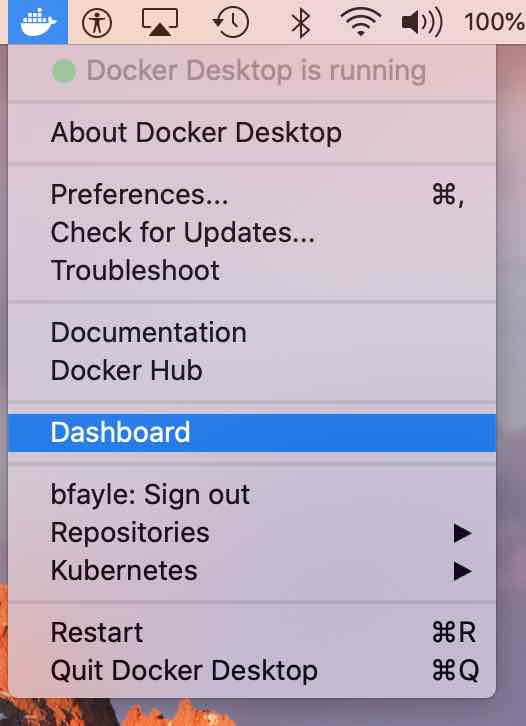
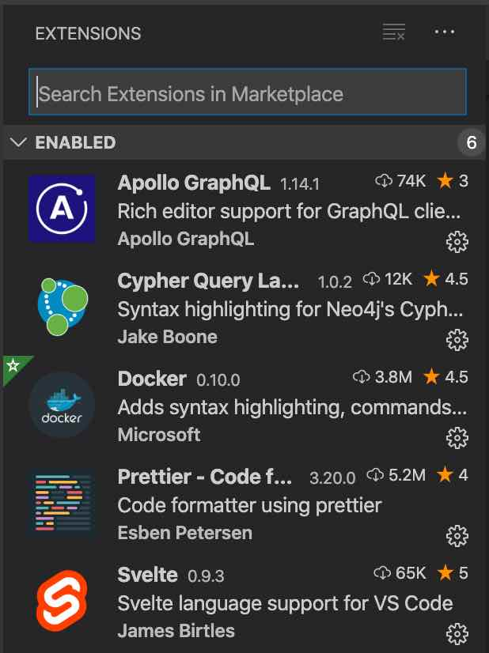

# Setting up a development environment

These are instructions for setting up a MacOS machine for development.

## Homebrew

We recommemd using Homebrew to aid the install process. You can find the install [here](https://brew.sh/)

## Nodejs

This project uses Node version 12. If you have node installed test which version you're running.

```
node -v
```

If you're not running version 12 then unlink node.

```
brew unlink node
```

Install Node 12 the desired version:

```
brew install node@12
brew link node@12
```

## Docker

When developing on the Mac it is a good idea to install [Docker Desktop](https://www.docker.com/products/docker-desktop)

This greatly simplifies running Docker on the Mac. Once installed you can access the Docker Dashboard to see when containers are running.



## Vscode

This was developed using Visuals Studio Code for node development.
Install from [here](https://code.visualstudio.com/)

In addition we recommend the extensions for Graphql, Neo4j, Svelte and Prettier. The project is configured to automatically format on save and these extensions are necessary to ensure a common formatting is used.


