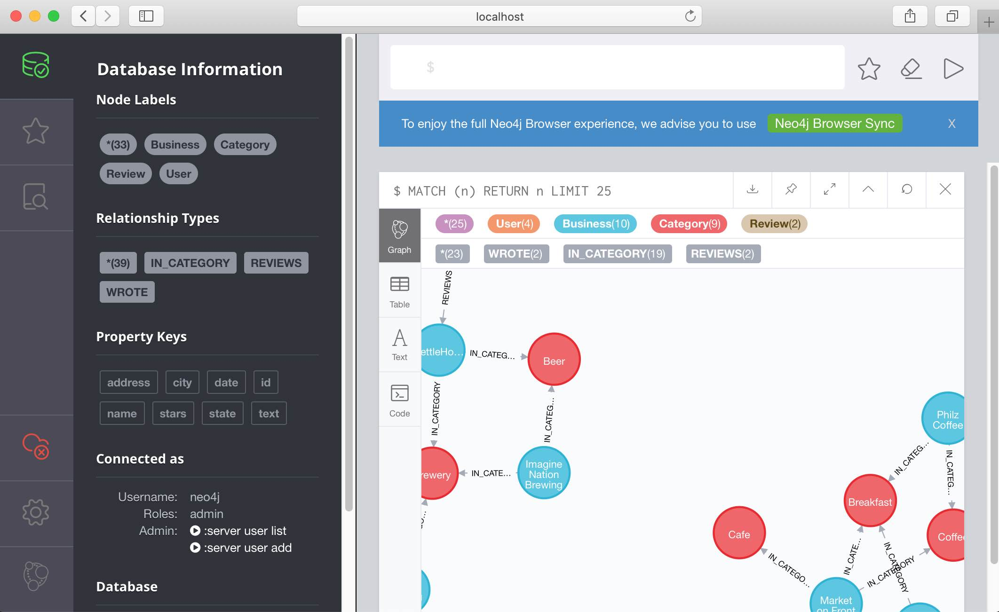
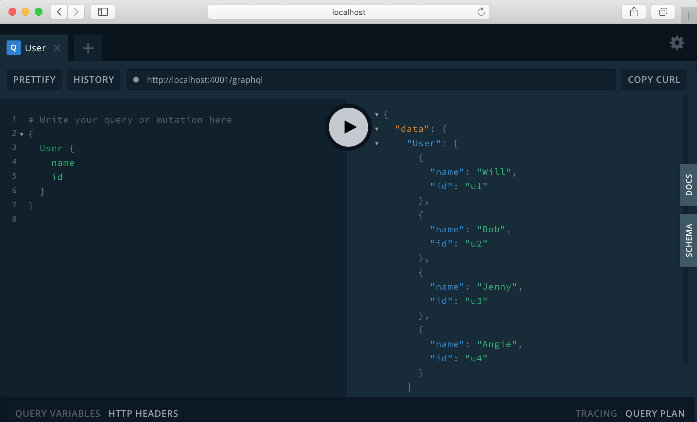
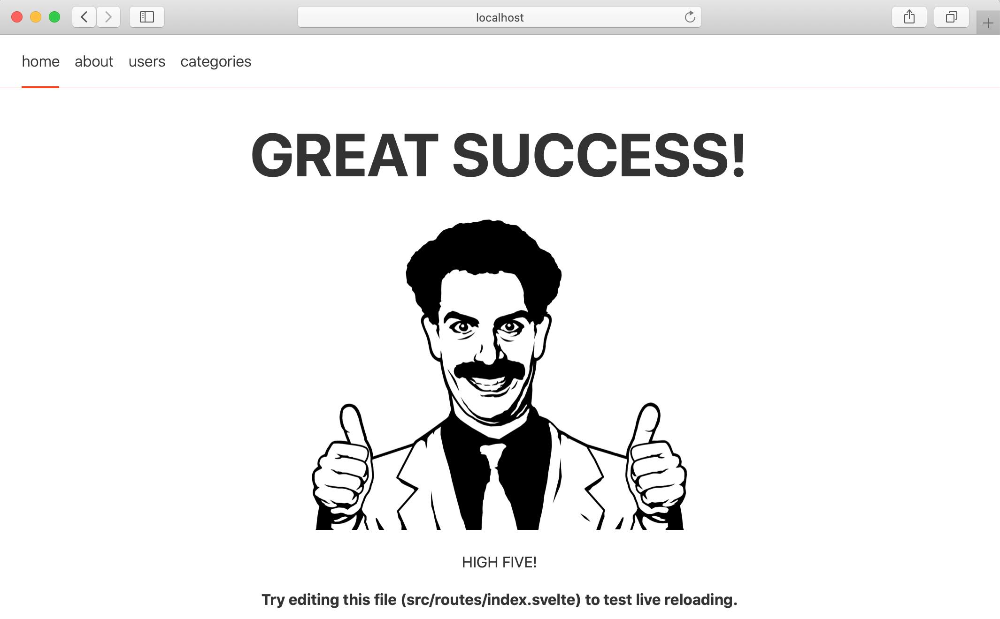

# SANDstack Starter

This project is a starter for building a SANDstack ([Sveltejs](https://svelte.dev/)/[Sapper](https://sapper.svelte.dev/), [Apollo GraphQL](https://www.apollographql.com/), [Neo4j Database](https://neo4j.com/neo4j-graph-database/)) application. There are two components to the starter, the UI application (a Svelte/Sapper app) and the API app (GraphQL server).

This project used as a starting point the api component from the [GRANDstack](https://grandstack.io) project and the ui component from the [Sapper template](https://github.com/sveltejs/sapper-template).

The ui app preloads the data for each page using [Sapper preloading](https://sapper.svelte.dev/docs#Preloading) and [Sapper server routes](https://sapper.svelte.dev/docs#Server_routes). The Graphql server is called internally by the server routes and does not need to be exposed to the client.

The [branch browser-apollo-client](https://github.com/vanbenj/sand-stack-starter/tree/browser-apollo-client) shows an alternate approach that does not use server routes but instead preloads the data in the `.svelte` pages directly from the GraphQL sever via a proxy defined in `server.js`.

The [branch svelte-apollo](https://github.com/vanbenj/sand-stack-starter/tree/browser-apollo-client) is similar to the [branch browser-apollo-client](https://github.com/vanbenj/sand-stack-starter/tree/browser-apollo-client) but also makes use of [svelte-apollo](https://github.com/timhall/svelte-apollo)

If you are new to Svelte this is a good [introductory video](https://youtu.be/AdNJ3fydeao)

The GRANDStack documentation provides a good overview of the [Neo4j GraphQL](https://grandstack.io/docs/neo4j-graphql-overview.html) integration.

## Quickstart

You can quickly start using Docker engine version 19 or later:
```
docker-compose up -d
```

List the running containers:
```
docker ps
```
There should be three containers started:
```
CONTAINER ID        IMAGE                      COMMAND                  CREATED             STATUS              PORTS                                                      NAMES
625acfa444fa        sand-stack-starter_ui      "docker-entrypoint.s…"   3 minutes ago       Up 2 minutes        0.0.0.0:3000->3000/tcp                                     sand-stack-starter_ui_1
843c5ea8d997        sand-stack-starter_api     "docker-entrypoint.s…"   3 minutes ago       Up 2 minutes        0.0.0.0:4001->4001/tcp                                     sand-stack-starter_api_1
8ae79170f66e        sand-stack-starter_neo4j   "/sbin/tini -g -- /d…"   3 minutes ago       Up 3 minutes        0.0.0.0:7474->7474/tcp, 7473/tcp, 0.0.0.0:7687->7687/tcp   sand-stack-starter_neo4j_1
```

Load the example DB after the services have been started:
```
docker-compose run api npm run seedDb
```

You should now be able to access the Neo4j database browser at [localhost:7474](http://localhost:7474) (you can log in using neo4j/letmein)



You should also be able to access the Apollo GraphQL browser at [localhost:4001/graphql](http://localhost:4001/graphql)



The application should be running at [localhost:3000](http://localhost:3000)


## Development mode

The project is set up to allow the api and ui servers to run in dev mode. This mode enables a watch on all files and automatically deploys when changes are saved. The following instructions show you how to start each server component separately.

If you've run the docker-compose script be sure to shut down the docker containers before starting in development mode.
```
docker-compose down
```

Be sure your development machine is running Node version 12.
```
node --version
```

### Neo4j

There are many ways to run Neo4j for development purposes. The [README](neo4j/README.md) in the `neo4j` directory describes several approaches. However the simplest is to start a stand alone Docker container using the DockerFile provided.

```
cd neo4j
docker build --tag neo4j .
docker run --detach --publish 7474:7474 --publish 7687:7687 --name neo4j-db neo4j
```

List the running containers:
```
docker ps
```

You should see a neo4j container:
```
CONTAINER ID        IMAGE               COMMAND                  CREATED             STATUS              PORTS                                                      NAMES
3c95a2947d49        neo4j               "/sbin/tini -g -- /d…"   9 seconds ago       Up 8 seconds        0.0.0.0:7474->7474/tcp, 7473/tcp, 0.0.0.0:7687->7687/tcp   neo4j-db
```

This is an empty database. We will load the seed data using the `api` server in the next step.

### Install dependencies
```
(cd ../ui && npm install)
(cd ../api && npm install)
```

### Start API Server
```
cd ../api
npm run dev
```
This will start the GraphQL API in the foreground in dev mode.

### Seeding the database
In another terminal session you may optionally seed the GraphQL service by executing mutations that will write sample data to the database:

```
cd ../api
npm run seedDb
```
### Start UI Server
```
cd ../ui
npm run dev
```
This will start the Svelte Sapper app in the foreground in dev mode. In dev mode when a file change is saved in the `ui` directory the web page should automatically reload with the changes.

### Prettier code
You run this command in either the `ui` or `api` directory to format the code.

```
./node_modules/.bin/prettier --write "src/**/*.{js,jsx,json,css,svelte}"
```

### Sapper Export

The ui component can be exported using [Sapper Export](https://sapper.svelte.dev/docs#Exporting). This crawls the site and creates a set of static pages they can be hosted and served as static files.

Start a new terminal.

```
cd ../ui
npx sapper export
```

This will create a ui/\_\_sapper\_\_/export folder with a production-ready build of your site. You can launch it like so:

```
npx serve __sapper__/export
```

Navigate to [localhost:5000](http://localhost:5000) (or whatever port serve picked), and verify that your site works as expected.

